# Arabic Math Solver - Android App

Arabic Math Solver is an Android Application that has the Ability to recognize and solve handwritten equations in Arabic notation.  
The application provides support to solve a wide range of mathematical problems   
e.g. (Simplifying - Solving Polynomials - Integration - Differentiation).  

## Table of Contents

- [Screenshots](#screenshots)
- [Features](#features)
- [Assumptions while usage](#assumptions-while-usage)
- [How to use ?](#how-to-use-?)
- [Example demos](#example-demos)
- [Related Projects](#related-projects)
- [License](#license)

## Screenshots

| Light Theme                                                  | Dark Theme                                                   |
| :----------------------------------------------------------- | :----------------------------------------------------------- |
| 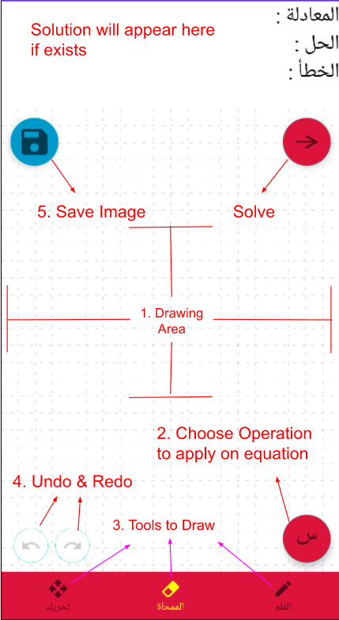 | 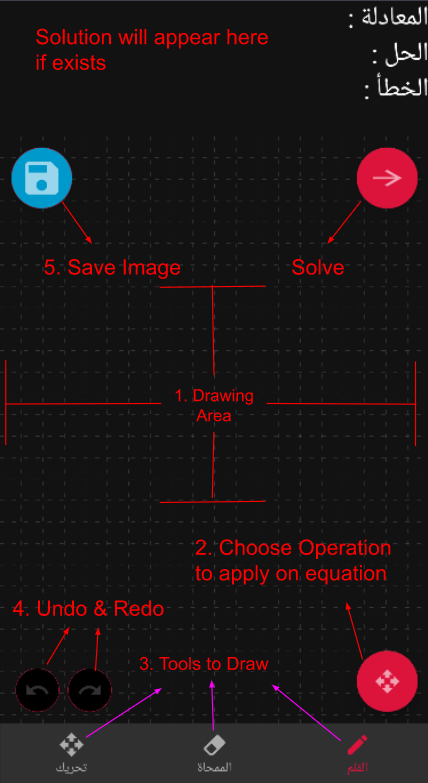 |

## Features

1. #### **Drawing Tools** 

   The user has the ability to use Pen and Eraser to freely draw the equation he wants.

| Using Eraser                                                 | Using Pen                                                    |
| :----------------------------------------------------------- | :----------------------------------------------------------- |
| 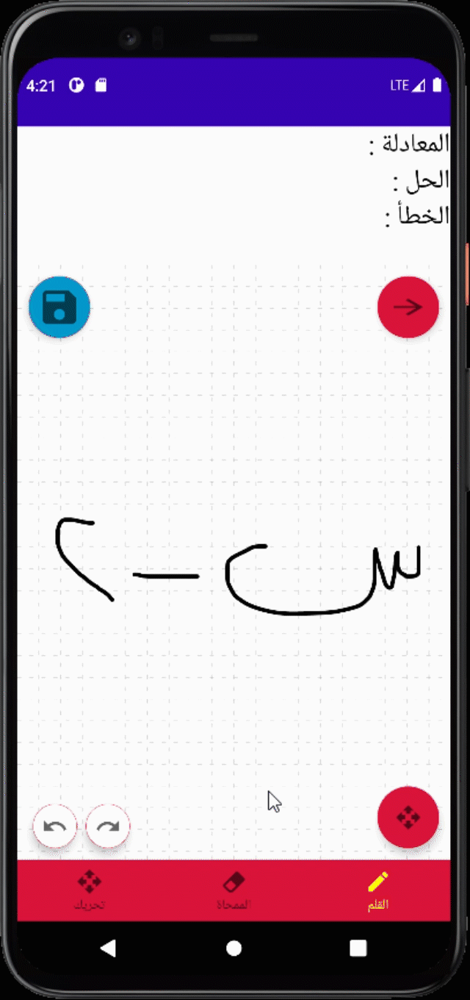 | 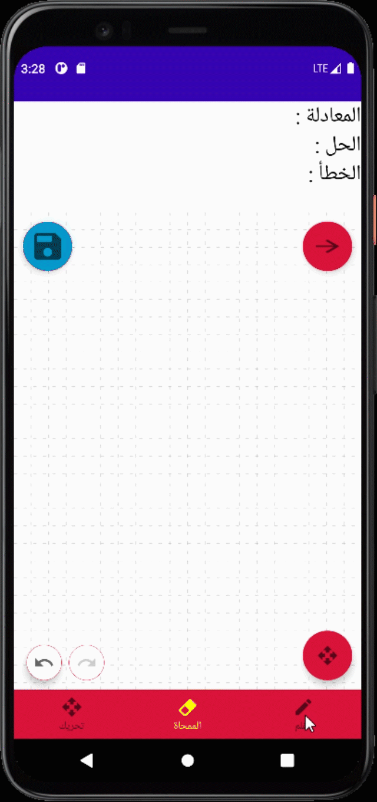 |

2. #### **Resize & Move** 

   The user has unlimited space to write the equation using Resize (2 Fingers) & Move (1 Finger) Button.

| Resize                                                       | Move                                                         |
| :----------------------------------------------------------- | :----------------------------------------------------------- |
|  |  |

3. #### **Undo & Redo** 

   The user can undo/redo any action he had done easily 

   

## Assumptions while usage

##### These are some assumptions that should be followed while using our application to have the best experience with it. 

#### 1. Dot-less symbols

- All characters, symbols and trigonometric symbols that have dots (except division sign ÷) should be written without any dots.

| Letters                                                      | Trigonometric Symbols                                        |
| :----------------------------------------------------------- | :----------------------------------------------------------- |
| 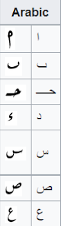 | 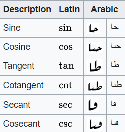 |

#### 2. Un-intersecting symbols

- All characters and symbols drawn are not intersecting at any point, a valid space that separates any two symbols from each other can be always found.

#### 3. Horizontal drawn equation

- The equation is drawn horizontally without any major inclinations.

| Valid equation                                               | invalid equation                                             |
| :----------------------------------------------------------- | :----------------------------------------------------------- |
| 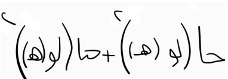 | 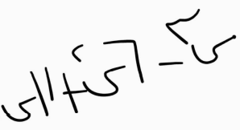 |

### 4. Fractions and Square roots

- #### The line, that separates denominator from numerator in a fraction, should be covering both the start and end symbols of both denominator and numerator.

| Valid fraction                                               | invalid fraction                                             |
| :----------------------------------------------------------- | :----------------------------------------------------------- |
| 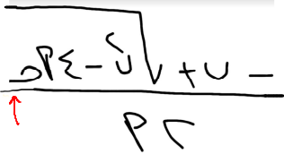 | 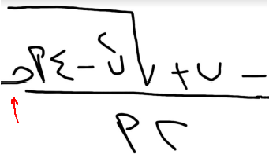 |

- The line of square root should cover all including symbols beneath it. 

| Valid square root                                            | invalid square root                                          |
| :----------------------------------------------------------- | :----------------------------------------------------------- |
| 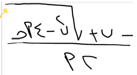 | 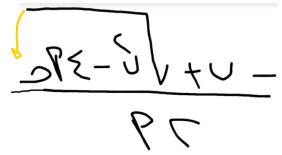 |

## How to use ? 

1. Draw, in the drawing area, the equation you want to solve.
2. Choose one of the operations to apply on equation.
3. Click on the solve button & wait for the solution to appear.
4. If no errors happen during equation solving happens, the App will show the seen-Arabic-equation (المعادلة) along with its solution in the upper panel,
   otherwise; error (الخطأ) will show explaining why it failed.

**N.B :** incase of error, you may also want to pay attention to what is shown in the seen-Arabic-equation (المعادلة) part to ensure that there are no wrong symbols seen.

## Example demos 

| Polynomial (إيجاد حدود)                                      | Simplification (تبسيط)                                       | Differentiation (تفاضل)                                      | Integration (تكامل)                                          |
| :----------------------------------------------------------- | ------------------------------------------------------------ | :----------------------------------------------------------- | ------------------------------------------------------------ |
|  |  |  |  |

## Related Projects 

[ArabicMathSolver-Server](https://github.com/omarshawky15/ArabicMathSolver-Server)

## License 

This application is released under GNU GPLv3 (see [LICENSE](LICENSE)).

For more details, see [the graduation project book.](Graduation_Project_Book.pdf)
